**I design and build production AI systems end to end: the architecture, the code, the security and the tests that prove they work.**

This page is the technical evidence behind my [website](https://nicchin.com) and CV. Every project below links to the code, the benchmark or the write-up.

**Hiring a Lead AI Architect, or need a fractional CTO?** [LinkedIn](https://www.linkedin.com/in/nic-chin) · [Email](mailto:nic.chin@nicchin.com)

---

## 📈 Track record

| 🏗️ 13+ production AI systems | 🤖 20-agent ensemble | 👥 Led a 15-person team |
|:---:|:---:|:---:|
| Delivered and running | 38,319 predictions scored against real outcomes | Architecture to production |

| 💰 $350K seed raised | 🌐 15K+ users | 🎓 Microsoft, Google & IBM |
|:---:|:---:|:---:|
| SculptAI | TAU Mine | AI certified |

🎤 **Speaker**: TechStars Startup Week · DeFi Summit London · LevelUP KL

---

## 🔥 What I've built, and how

<table>
<tr>
<td width="50%" valign="top">

### 🔌 Tools for AI agents (MCP)
**SystemAudit MCP server.** Ask Claude or Cursor "is this codebase safe?" and get a straight answer in seconds, from a tool I built that is listed in Claude's connector directory.

**Under the hood:** remote MCP server, three read-only tools. No model call: every figure comes from a deterministic scan, with files read stated.

</td>
<td width="50%" valign="top">

### 📄 Answers from documents, with sources
**DocsFlow, now SureCiteAI.** A private AI assistant for a company's own documents that shows the source behind every answer. Tested on 297 questions without inventing a single source.

**Under the hood:** hybrid retrieval with rank fusion, four tenant-isolation layers, four-model failover, abstention when evidence is weak. **0 hallucinated citations** in 297 benchmark cases.

</td>
</tr>
<tr>
<td width="50%" valign="top">

### 🤖 Many agents, one decision
**AI NeuroSignal.** Twenty AI agents with different strategies read the markets, and the system learns which ones to trust by checking every call against what really happened. Over 38,000 predictions tracked live.

**Under the hood:** parallel LLM calls with schema validation; deterministic voting that abstains on disagreement; 38,319 predictions scored against outcomes.

</td>
<td width="50%" valign="top">

### 🛡️ Security of AI-built software
**I studied 53 apps built with AI tools** like Lovable, Cursor and Claude Code. One in five had their passwords and keys committed to the code, and nearly three in four had no automatic security checks at all. AI makes apps fast to build, not safe to launch; this shows exactly where they break, with a checklist to fix it.

**Under the hood:** deterministic scan with no AI model in the loop, every credential finding checked by hand, anonymised dataset published. Citable via DOI.

</td>
</tr>
<tr>
<td width="50%" valign="top">

### 🪨 Checking what AI says it did
**Cairn, three Claude Code plugins.** AI coding assistants often say "fixed" when they haven't. These plugins check the AI's work, so a team can trust what it reports. Free and open source.

**Under the hood:** a script locates, the model judges. Every check has a self-test that plants a defect, run in CI. Results published, including a null.

</td>
<td width="50%" valign="top">

### 🔍 Understanding any codebase
**SystemAudit.** Paste a GitHub link and get a plain-English health report on any codebase in under three minutes: the kind of review that usually takes a consultant weeks.

**Under the hood:** open-source scanner engine (dependencies, import graph, health scoring) feeding a multi-pass AI layer. Findings carry file-and-line evidence.

</td>
</tr>
</table>

---

## 💼 Client work

| Project | What it did for the client |
|:--|:--|
| **AI Marketing Intelligence Platform** | Five AI tools under one supervisor agent run a creative business's marketing: writing in the owner's voice, finding leads and drafting replies. Saves 15–20 hours a week and is in daily use. |
| **AI legal document analyser** | Lawyers review 150–200-page fund agreements in minutes instead of 4–6 hours, without leaving Microsoft Word. |
| **Enterprise pharma AI security** | Took an AI platform for pharmaceutical manufacturers from prototype to enterprise pilot approval in 7 weeks, passing all 24 acceptance criteria. |
| **IoT utility platform, Germany** | Multi-tenant billing and device management connected to five metering companies' platforms, led as fractional CTO. |

All 13 production systems, with architecture and screenshots: [nicchin.com/portfolio](https://nicchin.com/portfolio)

---

## 🧭 How I build

  <picture>
    <source media="(max-width: 600px) and (prefers-color-scheme: dark)" srcset="assets/how-i-build-stacked-dark.svg">
    <source media="(max-width: 600px)" srcset="assets/how-i-build-stacked-light.svg">
    <source media="(prefers-color-scheme: dark)" srcset="assets/how-i-build-dark.svg">
    
  </picture>

<b>For technical reviewers: decisions worth asking me about</b>

 

| Decision | Where | Why |
|:--|:--|:--|
| Pinecone namespaces over pgvector | DocsFlow | Namespace-per-tenant maps directly onto isolation; no shared index to filter wrongly. |
| Abstain below a confidence threshold | DocsFlow | A refusal costs less than a confident wrong citation. Calibration is reported as ECE, Brier and AUROC. |
| Publish the hard benchmark | DocsFlow | CUAD legal scores 49% and FinanceBench passes at 63% (with 96% retrieval hit). A public hard corpus says more than 100% on an internal one. |
| No model in the MCP path | SystemAudit MCP | An agent acting on a figure needs the same figure every time. |
| Script locates, model judges | Cairn | The script makes checks repeatable at scale; the model supplies judgement a pattern can't. |
| Gate claims against the best naive baseline | AI NeuroSignal | 53% beats a coin flip but not "always short" by enough, so the system publishes no skill claim. |
| Measure a mechanism before tuning it | AI NeuroSignal | Replaying stored votes showed Elo-style weighting reversed the majority once in 5,125 signals, so ratings should choose who votes rather than reweight votes. |
| Keep best-effort writes out of the source-of-truth transaction | AI NeuroSignal | One failing side write silently rolled back a month of agent scoring; the fix separated it and made it fail loudly. |
| Supabase job queue over Redis | DocsFlow | Row-level security applies to jobs too, and there is one data layer to secure. |

More: [eleven case studies and five architecture decision records](https://github.com/nicuk/ai-architecture-portfolio), and the [Cairn plugin repos](https://github.com/nicuk/cairn-principles#the-plugins) for [memory](https://github.com/nicuk/claude-md-memory-architecture), [AI signals](https://github.com/nicuk/llm-silent-failure-audit) and [agent claims](https://github.com/nicuk/did-ai-really-fix-it).

---

## 🛠️ Stack

**AI & agents**

**Languages & backend**

**Frontend & cloud**

---

## 📬 Contact

Looking for **AI architecture, multi-agent systems, or fractional CTO leadership**?

&nbsp;

&nbsp;

